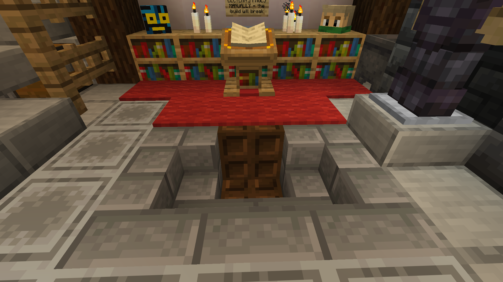
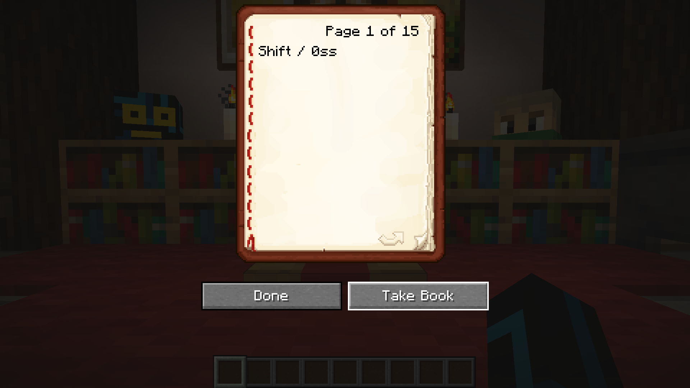
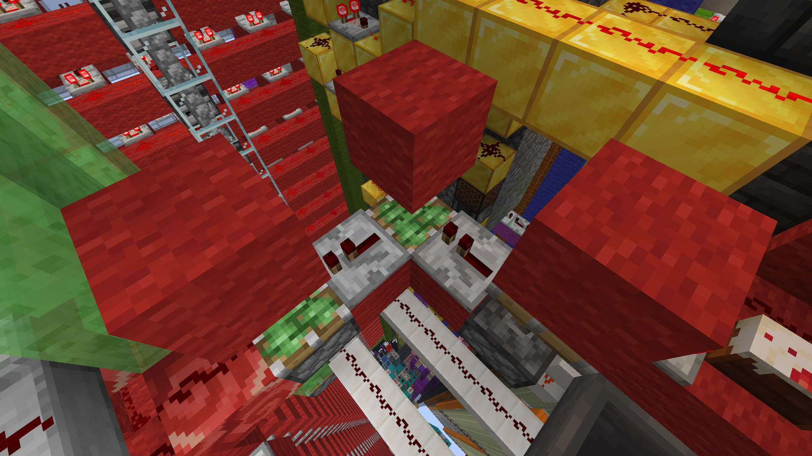
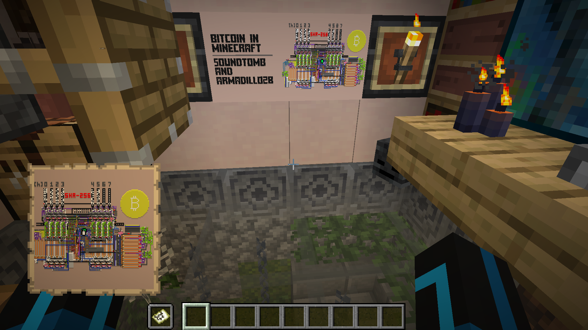
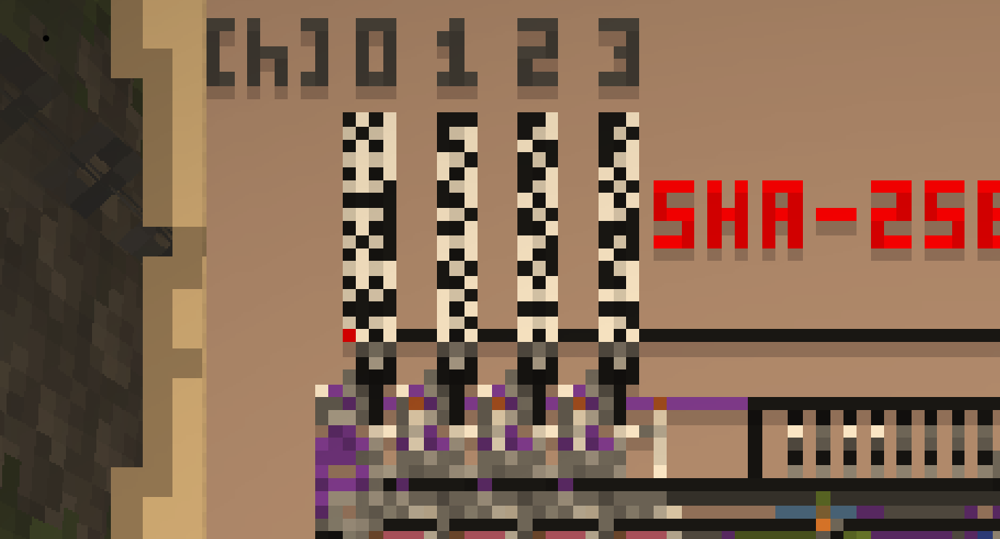

# Minecraft Bitcoin Miner

## Setup Instructions

* Reconsider. This software has been only been tested on Windows with a Minecraft server running on WSL.

* Install a [Bitcoin Node](https://bitcoin.org/en/full-node#what-is-a-full-node) (this will take up a large amount of disk space, so make sure you have enough).

* Install [Python](https://www.python.org/)

* If using Windows, install [Windows Subsystem For Linux](https://learn.microsoft.com/en-us/windows/wsl/install), and [set up a Minecraft server](https://minecraft.fandom.com/wiki/Tutorials/Setting_up_a_server#Linux_instructions) on WSL. If you try and run this with a singleplayer world, the log polling might not work.

* Clone or download this repository, and open a shell in the downloaded folder.

  ```sh
  git clone https://github.com/soundtomb/minecraft-bitcoin-miner.git
  cd minecraft-bitcoin-miner
  ```

  If you don't have git, you can download the repository as a zipped folder. Extract it and open up a shell in the extracted folder.

* Install the libraries. I recommend that you [create a virtual environment](https://docs.python.org/3/library/venv.html) first, so that there are no conflicts with any versions of Python you might already have installed. Once you're in the virtual environment, run this command to install all the dependencies.

  ```sh
  pip install -r requirements.txt
  ```

* Create a file named `.env`. Configure your credentials in `.env`. This should contain these secrets:

  | Variable Name      | Description                               |
  | ------------------ | ----------------------------------------- |
  | `RPC_URL`          | The URL of your Bitcoin node server       |
  | `RPC_USER`         | The Bitcoin node server's username        |
  | `RPC_PASS`         | The Bitcoin node server's password        |
  | `SCREENSHOTS_PATH` | Path to your Minecraft screenshots folder |
  | `LOG_PATH`         | Path to your Minecraft world’s chat logs  |

  For example:

  ```env
  RPC_URL=http://localhost:8332
  RPC_USER=your_username
  RPC_PASS=your_password
  SCREENSHOTS_PATH=/Path/To/Minecraft/Screenshots/Folder
  SCREENSHOTS_PATH=/Path/To/Minecraft/logs/latest.log
  ```

## Usage

### Running the Bitcoin Miner

Make sure you're still in the virtual environment. Start the player input script by running `main.py`.

```sh
python main.py
```

Stand on the trapdoor by the lectern, and open the book. Make sure it's on page 1. If it's not on page 1, take the book off of the lectern and place it back on. _Do not change the pages yourself._ That will cause the miner to break.

Once you have the lectern open on the first page, press the `Tab` key twice to focus on the "Take Book" button.




Then press the start key to start the miner. By default it's `, but it can be changed, see more in [[#Configuration]]

If you do accidentally turn the lectern's pages without using the script, here's what you do:

  1. _Touch grass._ The miner was expecting a flurry of inputs from the scripts, and at the end, it would start. By turning even one page, you've started the miner with bad data. There's no stopping it now, so just wait until it finishes. This should be done in about 10 minutes, so I suggest doing something relaxing to cool off, like having a nice cup of tea, or going for a walk.
  2. _Consider downloading the world again._ Seriously. This fix might not even work.
  3. Teleport to these coordinates:

  ```text
  /tp @s -68878.220444 133.772366 -69028.869268
  ```

  4. You should see three sticky pistons in an L shape with three red wool blocks on top of them. They should be two blocks above the piston, like so: 
  5. Try again
  6. Pray

### Reading the SHA256 state

If you want to read the output of SHA256, hold the map of the build provided in the world download in your off-hand slot and take a screenshot. Make sure that `starting_pixel_x` and `starting_pixel_y` are the coordinates of the red pixel in the bottom-left corner of the barcode section. Remember, x measures from left to right, and y measures from top to bottom. In this example image, the coordinates are

```json
{
  "starting_pixel_x": 143,
  "starting_pixel_y": 666,
}
```




Then run `data_out.py`. It will scan your most recent screenshot and output a hexadecimal representation of the final output.

```sh
python data_out.py
```

```text
Scanning:  C:\path\to\your\screenshot.png
Hash: 1dbd981fe6985776b644b173a4d0385ddc1aa2a8a9688d1e0000000000000000
```

## Configuration

This is done from `config.json`.

These are the settings for running the miner:

| Key                         | Description                                                                 |
| --------------------------- | --------------------------------------------------------------------------- |
| `seconds_between_chunks`    | Delay (in seconds) between each major chunk of transmitted data.            |
| `milliseconds_between_nibbles` | Delay (in milliseconds) between sending each nibble (4-bit value).       |
| `start_key`                 | Keyboard key that starts sending the block header.                          |
| `log_poll_interval`         | Number of seconds between checks of the log file for new chat messages.     |
| `dog_name`                  | The in-game name of the sacrificial dog.                                    |
| `player_name`               | The input player bot's username.                                            |
| `loop_attempts`             | Whether the script should loop mining attempts indefinitely.                |
| `use_test_header`           | Whether to use a test header instead of getting it from the Bitcoin netowrk.|
| `test_header`               | The test header to use, in hexadecimal.                                     |
| `coinbase_message`          | The bitcoin coinbase message.                                               |
| `address`                   | A bitcoin wallet receiving address.                                         |

And these are for reading the output screenshot:

| Variable Name               | Description                                                                 |
| --------------------------- | --------------------------------------------------------------------------- |
| `starting_pixel_x`          | X-coordinate of the starting pixel                                          |
| `starting_pixel_y`          | Y-coordinate of the starting pixel                                          |
| `num_x_squares`             | Number of values in the state plus the number of spacers.                   |
| `num_y_squares`             | Number of squares to scan vertically for each value of the state.           |

`num_x_squares` and `num_y_squares` shouldn't be changed unless you're repurposing the data-out module for something else.

## License

ntgbtminer is MIT licensed. See the provided [`LICENSE`](LICENSE) file.
